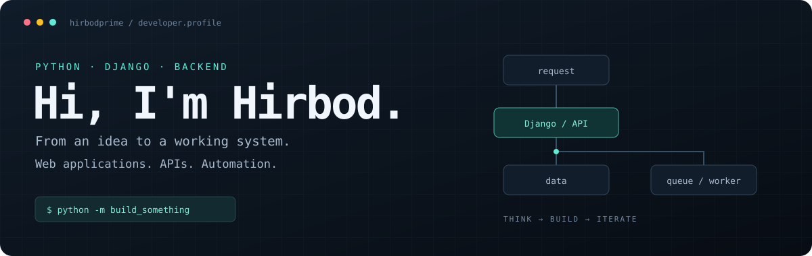

  

  <a href="mailto:hirbodprime@gmail.com">Email</a> &nbsp; / &nbsp;
  <a href="https://linkedin.com/in/hirbodprime">LinkedIn</a> &nbsp; / &nbsp;
  <a href="https://github.com/hirbodprime?tab=repositories">Explore my code</a>

## `01` / About me

I'm **Hirbod**, a Python and Django developer. I build web applications, backend APIs and automation tools — from e-commerce workflows to Telegram bots and data collection.

My main toolkit is **Python · Django · Django REST Framework · Redis · Celery · Linux**. I'm also exploring Docker, test-driven development and concurrency.

## `02` / Selected projects

<table>
<tr>
<td width="50%" valign="top">
<h3><a href="https://github.com/hirbodprime/flhub">FLHub</a></h3>

A Django application with subscriptions, wallets, reservations and background task processing.

<code>Django</code> <code>DRF</code> <code>Celery</code>

</td>
<td width="50%" valign="top">
<h3><a href="https://github.com/hirbodprime/asmodel-webapplication">Asmodel</a></h3>

A shop web application with product browsing, carts, wishlists, accounts and payment integration.

<code>Django</code> <code>E-commerce</code> <code>Redis</code>

</td>
</tr>
<tr>
<td width="50%" valign="top">
<h3><a href="https://github.com/hirbodprime/jobcollector">Job Collector</a></h3>

Job collection tooling combining website crawlers, Telegram integrations and asynchronous scheduling.

<code>Python</code> <code>Django</code> <code>asyncio</code>

</td>
<td width="50%" valign="top">
<h3><a href="https://github.com/hirbodprime/fridays">Fridays</a></h3>

A Django task management project with deadlines, member assignments and completion tracking.

<code>Django</code> <code>Task management</code>

</td>
</tr>
<tr>
<td width="50%" valign="top">
<h3><a href="https://github.com/hirbodprime/dobare">Dobare</a></h3>

A clothing submission and catalog application with photo uploads, product stories and public product links.

<code>Django</code> <code>Product catalog</code>

</td>
<td width="50%" valign="top">
<h3><a href="https://github.com/hirbodprime/django-coinmarketcap">Django CoinMarketCap</a></h3>

A Django interface for collecting cryptocurrency data and retrieving coins and logos by symbol.

<code>Django</code> <code>Data collection</code>

</td>
</tr>
</table>

## `03` / Let's connect

Interested in Python, Django or backend development? Reach me at **[hirbodprime@gmail.com](mailto:hirbodprime@gmail.com)** or connect on **[LinkedIn](https://linkedin.com/in/hirbodprime)**.

Build something useful. Understand how it works. Keep improving it.

